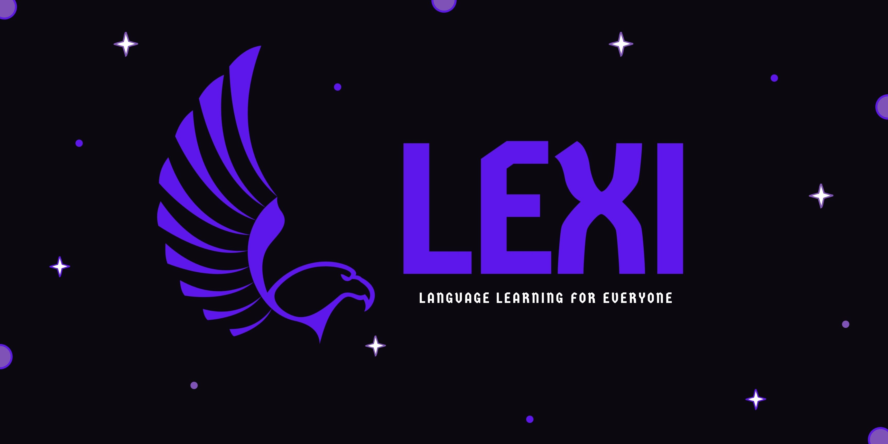

# Lexi

An open source tool for learning languages in a fun way. Learn languages by reading manga, writing with A.I aid, listening to song lyrics and much more.

## Screenshots

## NOTE

Project is in early development, no build is available for download. Alpha release soon to be released.
